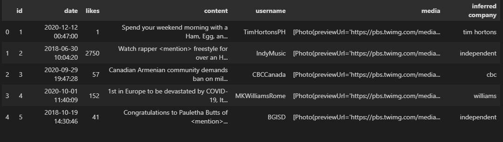
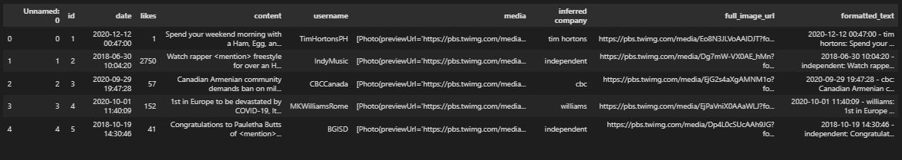
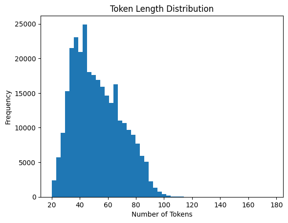
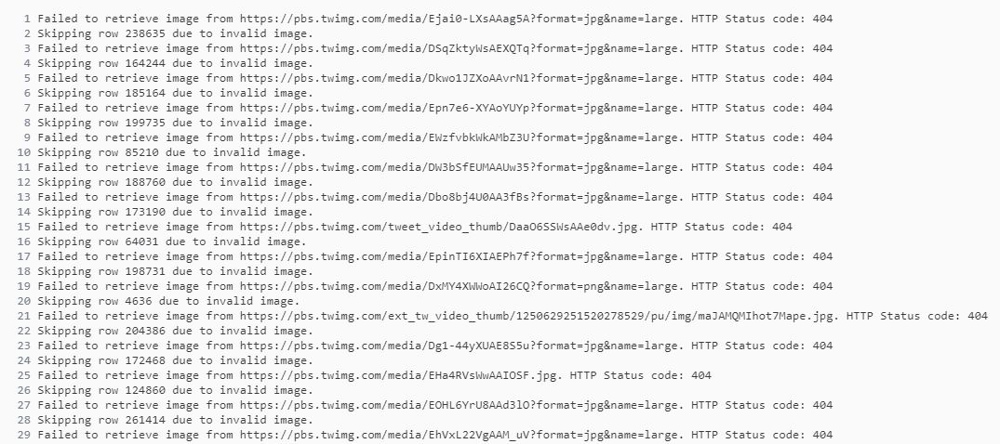

# 💬 **Problem Description**

The process of communication is defined by marketing researchers as below:
A receiver, upon receiving a message from a sender over a channel, interacts with the
message, thereby generating effects (user behavior). Any message is created to serve an end
goal. For a marketer, the eventual goal is to get the desired effect (user behavior) i.e. such as
likes, comments, shares and purchases, etc.


In this challenge, we will try to solve the problem of behavior simulation (Task-1) and content
simulation (Task-2), thereby helping marketers to estimate user engagement on their social
media content as well as create content that elicits the desired key performance indicators (KPI)
from the audience.

---

# :books: **Dataset**

Brands use Twitter to post marketing content about their products to serve several purposes,
including ongoing product campaigns, sales, offers, discounts, brand building, community
engagement, etc. User engagement on Twitter is quantified by metrics like user likes, retweets,
comments, mentions, follows, clicks on embedded media and links. For this challenge, we have
sampled tweets posted in the last five years from Twitter enterprise accounts. Each sample
contains tweet ID, company name, username, timestamp, tweet text, media links and user
likes.



## :bar_chart: Data Visualization

The content field alone is not sufficient to grasp the user behaviour so we create a new field
comprised of date,content and infered company called formatted_text. The full image URLs has also
been extracted in a new field to make it easier accessing the images.



The formatted_text field will be tokenized to be later used by the model, we need to understand
the token length distribution so that we can create a uniform token length for the model to use.



# :dart: **Solution**
## :clipboard: Task-1: Behavior Simulation
- Given the content of a tweet (text, company, username, media URLs, timestamp), the
task is to predict its user engagement, measured by likes.

## Approach :one:

Here we employ the use of DistilBERT a smaller and faster version of BERT.
We load a pre-trained model from the transfromers library.<br>

- The model outputs the hidden states, from which you select the embedding corresponding to the [CLS] token (first token).<br>
- After obtaining embeddings from BERT, a small feedforward neural network (fully connected layers) is used to predict the number of likes.<br>
- A Linear layer that transforms the hidden states (DistilBERT output) to a size of 180. The role of this layer is to reduce the dimensionality of the BERT embedding while retaining useful information. 
Here 180 corresponds to the maximum token length (177) in the given dataset.

```python
 nn.Linear(self.bert.config.hidden_size, 180),
 nn.ReLU(),
 nn.Linear(180, 1)  # Regression output
```
1. DistilBERT hidden state → 768 dimensions (CLS token)
2. First Linear Layer → 180 dimensions
3. ReLU Activation → Adds non-linearity
4. Second Linear Layer → 1 dimension (predicted likes)

- The loss function used is Mean Squared Error (MSE) because it's a regression task

## Approach :two:

In the previous approach we only utilised the formatted_text field to predict the no. of likes but as we can see we are leaving the media field which might contain useful information
pertaining to the no. of likes in a tweet.<br>
For this task we use a CLIP model.

The model expects images to be of size 224x224, so we load the image from the URL and resize it

```python
def load_image(image_url):
    response = requests.get(image_url)
    if response.status_code == 200:
        image = Image.open(BytesIO(response.content)).convert("RGB")
        image = image.resize((224, 224))
        return image
    else:
        return create_random_image(224, 224)
```

In my testing experienxce I found out that many URLs are not responsive and break the training loop. To counter this challenge I opted to create a random image of the same size to be given to the model
other than simply a black image.



```python
def create_random_image(width, height):
    random_image_array = np.random.randint(0, 256, (height, width, 3), dtype=np.uint8)
    random_image = Image.fromarray(random_image_array)
    return random_image
```

The model outputs image embeddings, text embeddings and logits.<br>
For a batch of 16 images and 16 text descriptions, the output shapes would be:
- Image embeddings: [16, 512]
- Text embeddings: [16, 512]
- logits_per_image: [16, 16]
- logits_per_text: [16, 16]

Firstly I used the logits to predict the no. of likes.<br>

Taking logits_per_image (or logits_per_text) and squeezing it out and averaging over all values to get the predicted no. of likes.

```python
def average_logits(logits):
    averages = torch.mean(logits, dim=1)
    return averages
```
Computes the MSE loss between predictions and targets.

⚠️ But there are few problems with this approach:
1. Logits are primarily used to measure image-text matching (how well a given image matches a given text prompt).
2. They don’t inherently represent features like image quality, content popularity, or audience engagement, which are crucial for predicting likes.
3. Averaging logits per image may cause a loss of meaningful information.

🌟 So instead of logits we use embeddings to predict the no. of likes.<br>
1. Extract the image and text embeddings from the CLIP model

```python
outputs = self.clip_model(input_ids=input_ids, pixel_values=pixel_values)

image_embeddings = outputs.image_embeds  # Shape: [16, 512]
text_embeddings = outputs.text_embeds    # Shape: [16, 512]
```
2. Then we concatenate the two embeddings along the last dimension

```python
combined_embeddings = torch.cat((image_embeddings, text_embeddings), dim=1)  # Shape: [batch_size, 1024]

```
3.  The combined embeddings are passed through a regression head to predict the number of likes.

```python
# 512 (image embedding) + 512 (text embedding) = 1024 input to the regression head
self.regression_head = nn.Linear(1024, 1)
```

```python
predicted_likes = self.regression_head(combined_embeddings)  # Shape: [batch_size, 1]
```

## :clipboard: Task 2: Content Simulation
- Given the tweet metadata (company, username, media URL, timestamp), generate
the tweet text.

## Approach

We want to generate the content of a tweet given the metadata. This task essentially requires understanding the relationship between the images and structured metadata.<br>
We will use our pre-trained CLIP model to gnerate embeddings

1. Extract the image embeddings from the CLIP model as usual.

```python
clip_outputs = self.clip_model(pixel_values=image)
image_embeddings = clip_outputs.image_embeds  # Shape: [batch_size=16, 512]
```
2. Convert the timestamp and company name into embeddings

```python
self.timestamp_embedding = nn.Linear(1, 64)
self.company_embedding = nn.Embedding(company_vocab_size, company_emb_size)
self.fc = nn.Linear(512 + company_emb_size + 64, 512)
```

3. The image, timestamp, and company embeddings are combined together and passed through

```python
clip_outputs = self.clip_model(pixel_values=image)
image_embeddings = clip_outputs.image_embeds  # Shape: [batch_size=16, 512]
timestamp_embeddings = self.timestamp_embedding(timestamp.unsqueeze(1))  # Shape: [batch_size=16, 64]
company_embeddings = self.company_embedding(company_name)
combined_embeddings = torch.cat((image_embeddings, timestamp_embeddings, company_embeddings), dim=1)  # Shape: [batch_size=16, 512 + 64 + company_emb_size]
combined_embeddings = self.fc(combined_embeddings)
```

4.  These are passed through a transformer to generate text

```python
self.transformer_decoder = nn.TransformerDecoder(
            nn.TransformerDecoderLayer(d_model=512, nhead=8),
            num_layers=4
        )
```

```python
target_seq = target_seq.unsqueeze(1)  # Shape: [16, seq_len=1, 512]    
transformer_output = self.transformer_decoder(target_seq, combined_embeddings.unsqueeze(1))  # Shape: [batch_size=16, seq_len, 512]
predicted_tokens = self.output_layer(transformer_output)  # Shape: [batch_size=16, seq_len, vocab_size]

```

- Additionaly we can convert the timestamp(date) to no. of days since a refrence date

```python
def preprocess_timestamp(timestamp):
    reference_date = pd.Timestamp("2018-01-01")  # Example reference date
    timestamp = pd.Timestamp(timestamp)
    days_since_reference = (timestamp - reference_date).days
    return torch.tensor([days_since_reference], dtype=torch.float32)
```
This method ignores the time of the day at which the tweet is posted and only considers the date.<br>
It might have trouble performing on the unseen time period dataset so going with embeddings created by a fully connected layer might be better.

- Cross Entropy Loss is used for text generation

Hyperparameters can be adjusted to see changes in result:
- company_emb_size = 128  # Size of company embedding
- hidden_size = 512  # Size of the hidden layer
- vocab_size = 30522  # Vocabulary size for text generation (e.g., from a tokenizer like GPT)
- num_heads = 8  # Number of attention heads
- num_layers = 4  # Number of transformer layers
