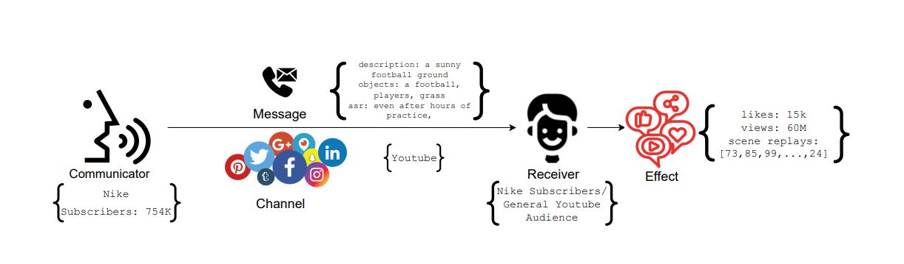

# 💬 **Problem Statement**

The process of communication is defined by marketing researchers as below:
A receiver, upon receiving a message from a sender over a channel, interacts with the
message, thereby generating effects (user behavior). Any message is created to serve an end
goal. For a marketer, the eventual goal is to get the desired effect (user behavior) i.e. such as
likes, comments, shares and purchases, etc.

In this challenge, we will try to solve the problem of behavior simulation (Task-1) and content
simulation (Task-2), thereby helping marketers to estimate user engagement on their social
media content as well as create content that elicits the desired key performance indicators (KPI)
from the audience.

---

# **Dataset**

Brands use Twitter to post marketing content about their products to serve several purposes,
including ongoing product campaigns, sales, offers, discounts, brand building, community
engagement, etc. User engagement on Twitter is quantified by metrics like user likes, retweets,
comments, mentions, follows, clicks on embedded media and links. For this challenge, we have
sampled tweets posted in the last five years from Twitter enterprise accounts. Each sample
contains tweet ID, company name, username, timestamp, tweet text, media links and user
likes.

## Data Visualization

The content field alone is not sufficient to grasp the user behaviour so we create a new field
comprised of date,content and infered company called formatted_text. The full image url has also
been extracted in a new field to make it easier accessing the images.

The formatted_text field will be tokenized to be later used by the model, we need to understand
the token length distribution so that we can create a uniform token length for the model to use.

